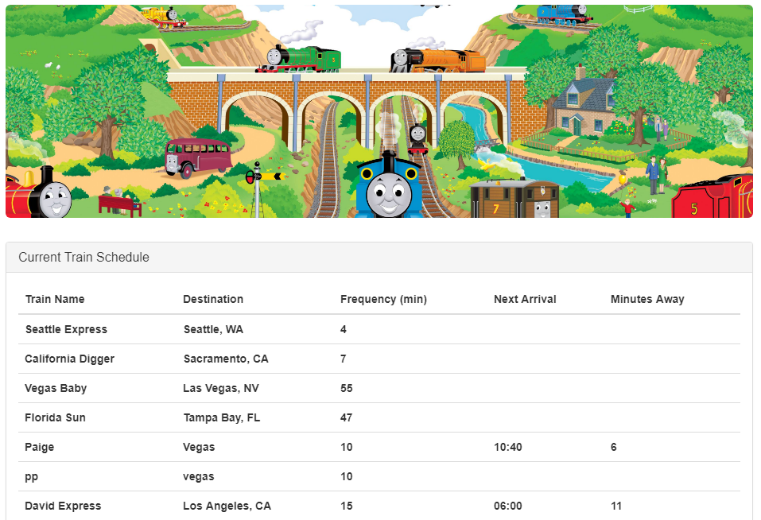
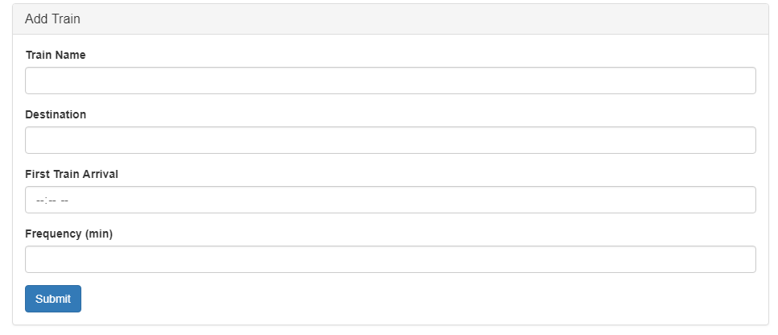

# TrainSchedule

## Overview
This application retrieves persistent data showing the arrival and departure times of trains. It provides real-time information about various trains based on their intervals, giving their arrival times and how many minutes remain until those arrivals. Time is manipulated using Moment.js.

Users can view the same information with changes occuring and displaying accross different machines.

## Tools Used
1. Firebase
2. Moment.js

## DEMO
[https://kiddmit3.github.io/TrainSchedule/](https://kiddmit3.github.io/TrainSchedule/)
